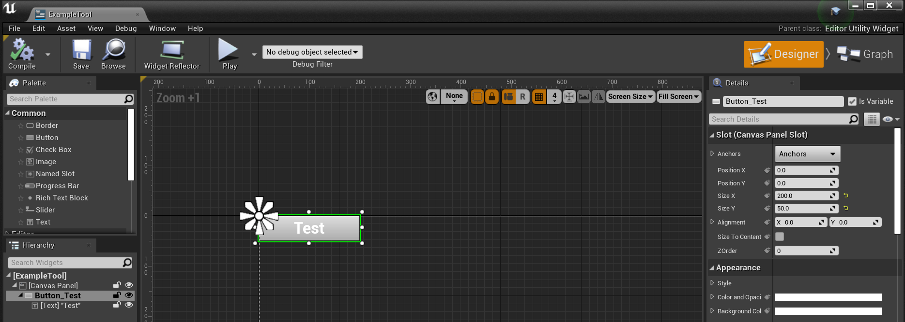
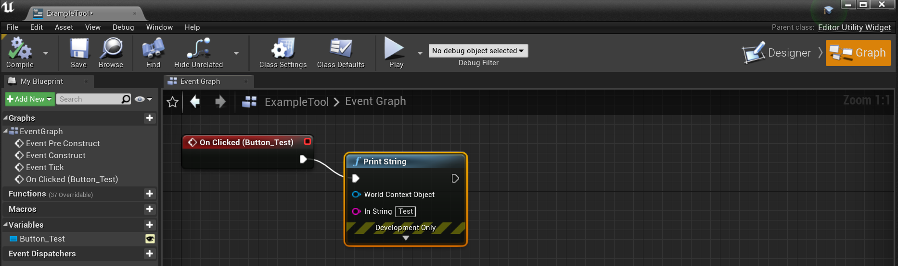
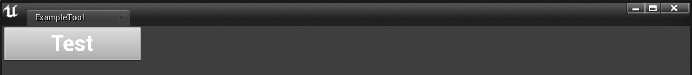

# 언리얼 에디터 유틸리티 위젯 예제 (UE4 EditorUtilityWidget)

Content 컨텍스트 메뉴 > Editor Utilities > Editor Utility Widget 선택: `ExampleTool`

Test 버튼 생성



Test 버튼 이벤트 작성



ExapleTool 컨텍스트 메뉴 > Run Editor Utility Widget



Output Log 확인

```
LogBlueprintUserMessages: [ExampleTool_C_0] Test
```